# discord-bot-tutorial-KOR (강의용)

KWU-bot 강의를 위한 디스코드 봇 튜토리얼입니다.

Fork를 통해서 개인 레포지토리에서 작업을 할 겁니다.

## 필요한 프로그램

1. VSCode 에디터(Atom, PyCharm, 등 개인에게 맞는 에디터 사용해도 됩니다)

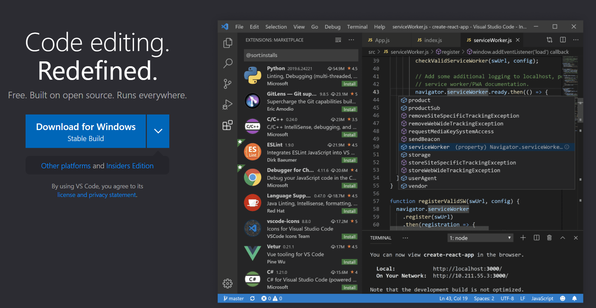

2. Github Desktop (git 사용 방법 아는 분이면 안해도 됨)

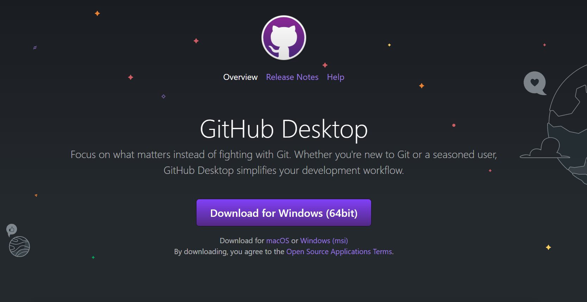

3. Python 3.8
   1. Windows를 사용하는 분이면 Microsoft Store에서 설치하는 걸 권장드립니다

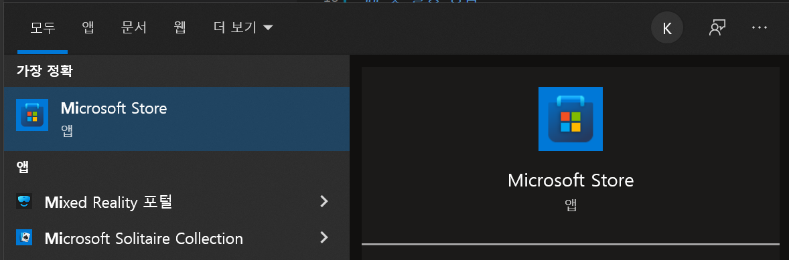

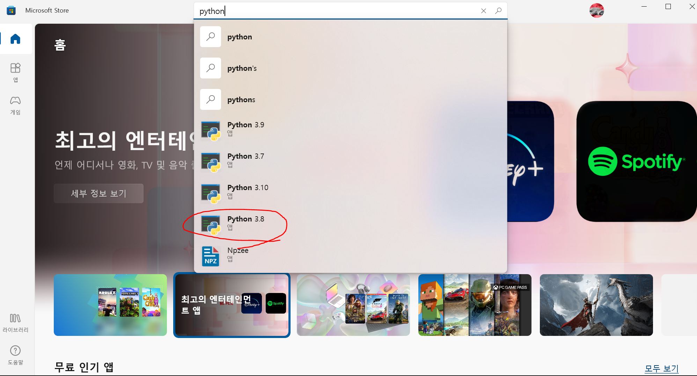

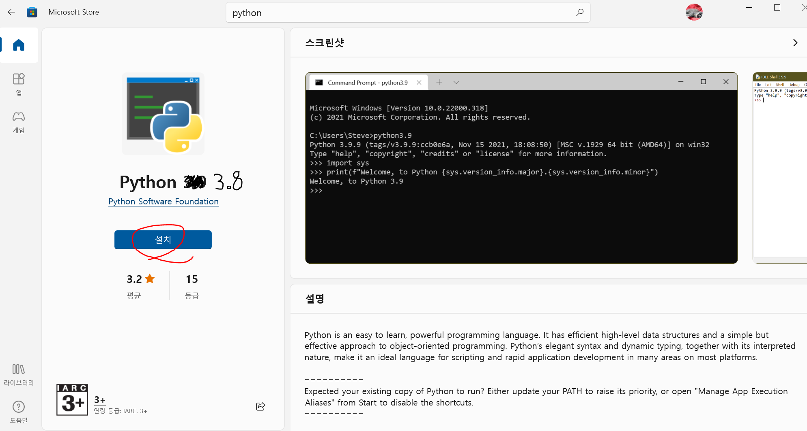

## 봇 실행 방법

1. `main.py` 스크립트가 있는 파일 위치가 있는 곳으로 이동하세요

### 이동하는 방법 1

익스플로러, 빈 공간을 우클릭 하면 경로를 복사할 수 있습니다.

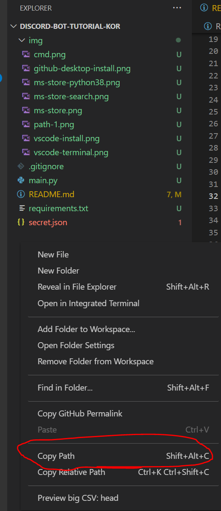

`윈도우 키 + R` 을 눌러서 실행을 띄워서 `cmd`를 입력하고 엔터를 눌러 터미널을 실행합니다.

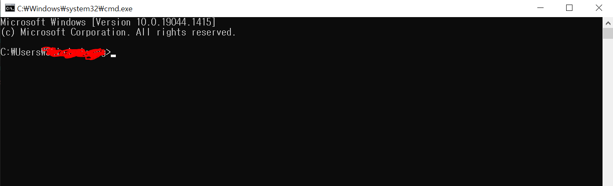

그리고 `cd (복사한 경로)`를 적고 엔터를 누릅니다.

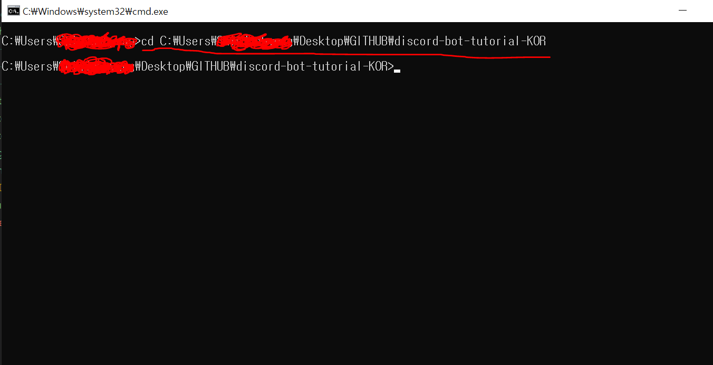

### 이동하는 방법 2

또는 ``Shift + `(backtick, 백 틱)``을 치면 VSCode에 내장된 터미널을 사용할 수 있습니다.

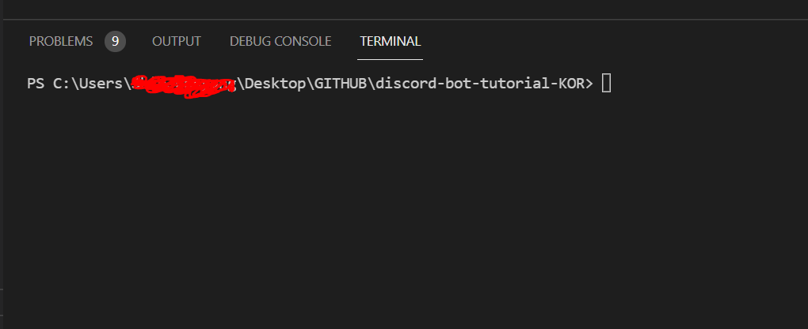

-----

2. 필요한 패키지를 설치합니다

```sh
pip install -U -r requirements.txt
```

패키지에 `git+ .. ` 이런식으로 레포지토리 이름이 있는 이유는

아직 pycord 개발자가 pypi에 정식 버전을 릴리즈 하지 않았기 때문입니다(2022-01-12 기준).

나중에 이 레포지토리를 보시는 분들이라면 `pip install py-cord`을 입력하시면 2.0.0 이상 버전을 받으실 수 있을겁니다!

-----

3. 발행한 봇 토큰을 불러올 json 파일 만들기

`secret.json` **파일을 만들고** 아래와 같이 내용을 적으세요

```json
{
    "token" : <Discord-developer-portal에서 복사한 토큰>
}
```

4. 샘플 봇이 작동하는지 확인하기

`main.py`가 있는 디렉토리 경로에서 터미널을 열어서 (위 이동하는 방법 1,2 참고) 다음 명령어를 실행합니다.

```sh
python main.py
```

다음과 같이 실행되는 것을 볼 수 있고,

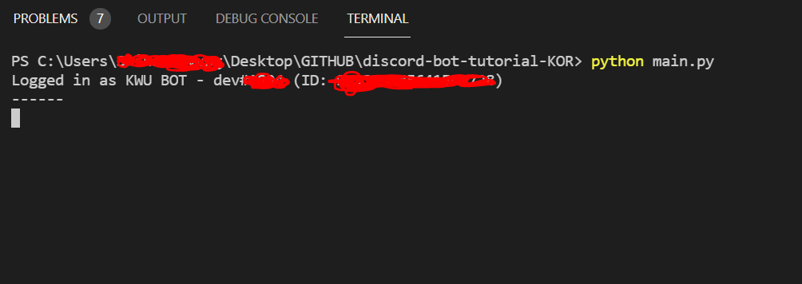

디스코드 상에서 로그인 되어 있는 것을 확인할 수 있습니다.

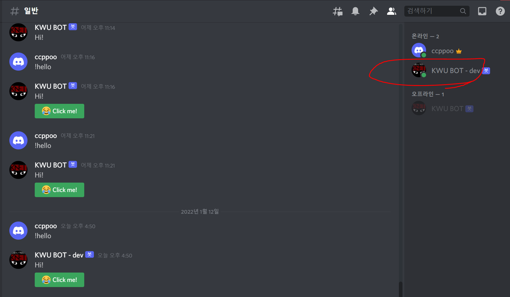

## 개발 시작

디스코드 API 문서와 py-cord의 문서를 읽으면서 기능을 추가하세요!

디스코드 API - [링크](https://discord.com/developers/docs/intro)

py-cord 문서 - [링크](https://docs.pycord.dev/en/master/)