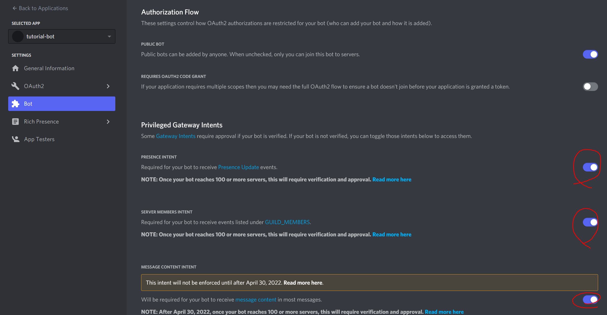
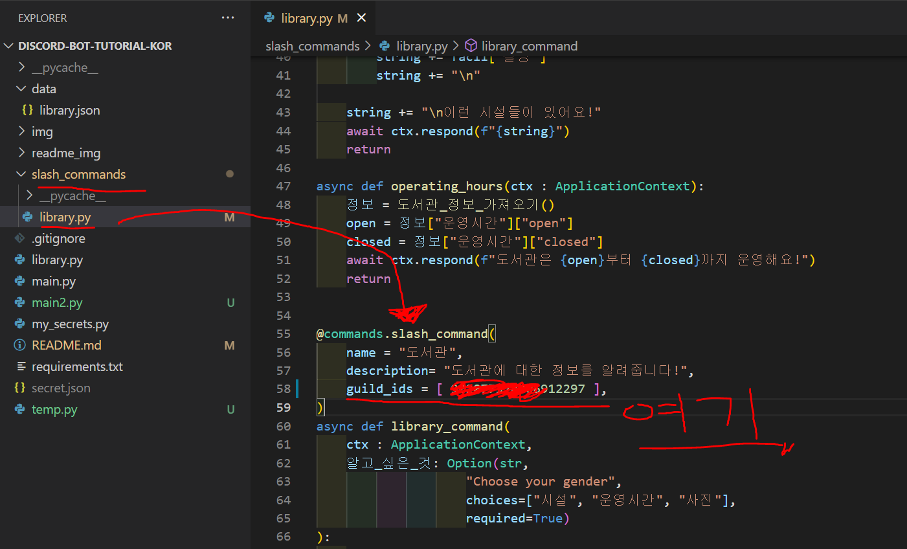

# discord-bot-tutorial-KOR (강의용)

KWU-bot 강의를 위한 디스코드 봇 튜토리얼입니다.

Fork를 통해서 개인 레포지토리에서 작업을 할 겁니다.

## 필요한 프로그램

1. VSCode 에디터(Atom, PyCharm, 등 개인에게 맞는 에디터 사용해도 됩니다)


2. Github Desktop (git 사용 방법 아는 분이면 안해도 됨)


3. Python 3.8
   1. Windows를 사용하는 분이면 Microsoft Store에서 설치하는 걸 권장드립니다
   2. 반드시 3.8 버전으로 설치해주세요


## 봇 실행 방법

0. 봇을 테스트 서버에 초대하기

봇을 초대할 땐 반드시 사진에 나온 모든 것을 따라해주세요!

https://discord.com/developers/applications 으로 가셔서 로그인을 하면 화면 상단 오른쪽에 있는 `New Application`을 보실 수 있습니다.

클릭하면 다음과 같은 화면이 보입니다.


생성된 봇 프로필을 클릭하면 다음과 같은 화면이 보입니다.


**1번**은 애플리케이션 ID 입니다.

디스코드 파이썬 라이브러리를 사용할 때 필요한 경우는 적지만, 언젠간 필요한 때가 올 수 있으니 위치 정도는 알고 계시면 좋습니다.

앞으로 코드를 통해서 애플리케이션을 구동할 때 사용하게될 주민등록번호와 같은 존재입니다.

**2번**은 여러분의 애플리케이션을 `Bot`으로 등록하는 곳입니다.

애플리케이션 == Bot 이 아니라, 애플리케이션이 사람처럼 보일 수 있는 (디스코드 채팅창 오른쪽에 온라인이라고 보이는) 애플리케이션이 봇이라고 보시면 됩니다.

즉, 봇은 애플리케이션의 부분집합과 같은 존재입니다.

**3번**은 여러분이 봇을 여러분의 테스트 서버(길드)에 초대할 때 생성할 URL입니다.

봇은 서버의 운영자만 초대할 수 있습니다. 

우선 **1번**에 해당되느

일단 애플리케이션에 봇을 등록하기 위해서 **Bot** 메뉴로 들어 가겠습니다.


그리고 옆에 보이는 `Add Bot`을 클릭해주시고, 확인을 누르시면 됩니다.

그러면 아래와 같은 사진을 보실 수 있습니다.


여러분이 앞으로 다루게 될 봇의 프로필 화면입니다↑↑↑.

이제 중요한 것이 봇을 초대하기 전에 권한을 미리 부여하는 것 입니다.

2021년 이전까지는 이런 권한 부여가 없었지만, 봇이 관리자 권한을 가지고 있으면 사용자의 아이디와 식별자까지 읽을 수 있는 막강한 권한을 가지고 있었기 때문에

애초에 초대를 할 때 이 권한을 미리 설정하도록 하는 겁니다.

100 개 이상의 서버에 활동하게 될 경우 디스코드 본사에 봇 개발자의 신분을 밝히는 등, 개인정보에 대해서 민감하게 다루는 만큼 막강한 권한입니다.

일단 여러분이 권한이고 뭐고 따지기 전에 봇의 기능을 구현하고 사용하는 것이 중점이므로 모든 권한을 사용할 수 있도록 

**아래 화면과 같이 스크롤을 내려서 체크합시다**.



그 다음으로는 봇을 초대하기 위한 링크를 생성하기 위해 OAuth2 메뉴에 들어가 `URL Generator`를 클릭합시다.

이 예제에서는 slash command(application command)를 사용하기 때문에

빨간색 동그라미가 쳐져있는 것처럼

*bot* 권한과, *application commands* 권한을 클릭할 겁니다 ↓.


그 다음으로 위(↑) 화면에서 아래로 스크롤을 내리면 생성된 URL을 보실 수 있습니다.


URL을 복사를 하고 링크를 들어가면 초대화면을 볼 수 있습니다.

다시 한 번 말씀드리면 봇은 자신이 소유하고 있는 서버 밖에 초대를 못 합니다.


이런 ↑ 화면을 보셨다면 초대 성공!!

-------- 

1. `main.py` 스크립트가 있는 파일 위치가 있는 곳으로 이동하세요

### 이동하는 방법 1

익스플로러, 빈 공간을 우클릭 하면 경로를 복사할 수 있습니다.


`윈도우 키 + R` 을 눌러서 실행을 띄워서 `cmd`를 입력하고 엔터를 눌러 터미널을 실행합니다.


그리고 `cd (복사한 경로)`를 적고 엔터를 누릅니다.


### 이동하는 방법 2

또는 ``Shift + `(backtick, 백 틱)``을 치면 VSCode에 내장된 터미널을 사용할 수 있습니다.


-----

2. 필요한 패키지를 설치합니다

```sh
pip install -U -r requirements.txt
```

패키지에 `git+ .. ` 이런식으로 레포지토리 이름이 있는 이유는

아직 pycord 개발자가 pypi에 정식 버전을 릴리즈 하지 않았기 때문입니다(2022-01-12 기준).

나중에 이 레포지토리를 보시는 분들이라면 `pip install py-cord`을 입력하시면 2.0.0 이상 버전을 받으실 수 있을겁니다!

-----

3. 발행한 봇 토큰을 불러올 json 파일 만들기

`secret.json` **파일을 만들고** 아래와 같이 내용을 적으세요

```json
{
    "token" : <Discord-developer-portal에서 복사한 토큰>
}
```

파일의 위치는 DISCORD-BOT-TUTORIAL-KOR 폴더 내부, `main.py`와 같은 위치 입니다.

4. 샘플 봇이 작동하는지 확인하기

`main.py`가 있는 디렉토리 경로에서 터미널을 열어서 (위 이동하는 방법 1,2 참고) 다음 명령어를 실행합니다.

```sh
python main.py
```

다음과 같이 실행되는 것을 볼 수 있고,


디스코드 상에서 로그인 되어 있는 것을 확인할 수 있습니다.


## slash_command 예시 따라하기, 채팅 서버(길드) ID 찾는 방법

**slash command**는 **application command**라는 이름으로도 불리니 혼동이 없으시길 바랍니다.

여러분이 봇을 테스트 하는 채팅 서버(길드)에 들어가서

채널 리스트가 있는 부분 위에 우클릭을 합니다.


그 다음 서버 설정의 **위젯**으로 들어가 서버 아이디를 복사합니다.


그리고 `slash_commands` 디렉토리의 `library.py`를 보시면

한글로 `여러분의 테스트 서버 아이디`를 지우고 길드 ID를 붙여 넣습니다.



`guild_id`는 원칙상 비어 있어도 되지만, 그렇게 할 경우 디스코드에

슬래시 커맨드(slash command) 자동완성이 업데이트 되기까지 시간이 오래 걸릴 수 있으므로

해당 서버에서만 적용이 되도록 설정을 하는 겁니다.

새롭게 서버(길드) ID를 복붙하고 저장하고 실행하면 다음과 같은 모습을 볼 수 있습니다.


## 개발 시작

디스코드 API 문서와 py-cord의 문서를 읽으면서 기능을 추가하세요!

디스코드 API - [링크](https://discord.com/developers/docs/intro)

py-cord 문서 - [링크](https://docs.pycord.dev/en/master/)